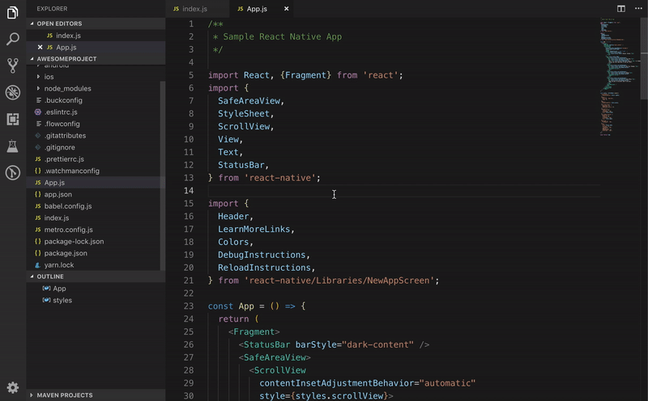
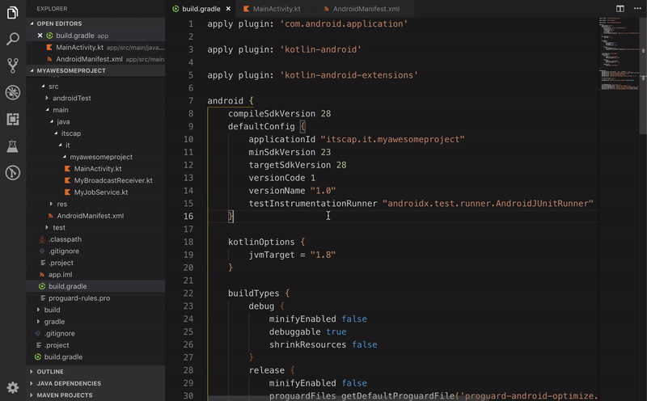

# apk-locator

A VS Code extension that effortlessly find and open the enclosing folder of your generated apk files. 

## Why do i need this?

If you are tired of manually searching for the generated apk file every time you launch a build in VS Code you might want to give this a try 🙂

Inspired by `Locate` function of Android Studio, this should be particularly useful with React Native projects, but you can use it with native project too.

## Usage

Just open Command Palette and type `Locate APK` command:

```
CMD + Shift + P -> Locate APK
```



It will open apk's folder directly if project doesn't contain multiple `flavor` or `buildTypes`



Or will let you choose [build variant](https://developer.android.com/studio/build/build-variants) otherwise

## Features

* Detects if workspace root path contains an Android Project
* Detects if a build has already been done 
* Choose which build variant you want to open
* Opens the enclosing folder containing your apk file 🎁
